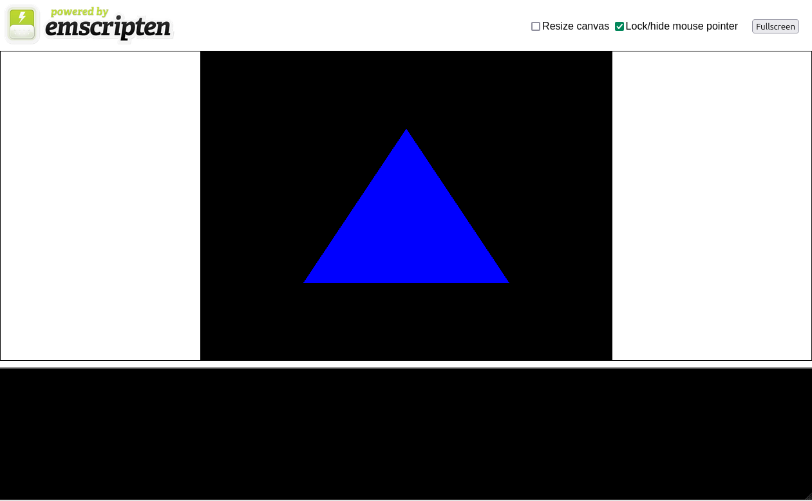

# OpenGL ES 2.0 Blue Triangle Example

This is a simple C program that uses SDL2 and OpenGL ES 2.0 to create a window and render a blue triangle. It serves as a basic introduction to setting up an OpenGL ES 2.0 rendering context on Linux using SDL2.

## Requirements

- SDL2 library (`libsdl2-dev`)
- OpenGL ES 2.0 library (`libgles2-mesa-dev`)
- GCC or any C compiler that supports the above libraries

### Installation on Linux (Debian / Ubuntu)

Install the necessary libraries:

```bash
sudo apt update
sudo apt install libsdl2-dev libgles2-mesa-dev gcc make
```

### How to Build

Clone this repository:

```bash
git clone https://github.com/kion-dgl/SDL-C-Triangle.git
cd SDL-C-Triangle
```

Build the project using the provided Makefile:

```bash
make
```

Run the executable:

```bash
./triangle
```


## Compile for Web

Requires [emcc](https://emscripten.org/docs/getting_started/downloads.html)

```bash
make web
python3 -m http.server 8080 --directory ./docs
```



## Project Structure

```
.
├── docs/           # The compiled webasm
├── main.c          # The main C program
├── Makefile        # Makefile to build the project
├── .gitignore      # Files to be ignored by Git
├── preview.png     # Preview of the example output
└── README.md       # This README file
```

## License

MIT License
